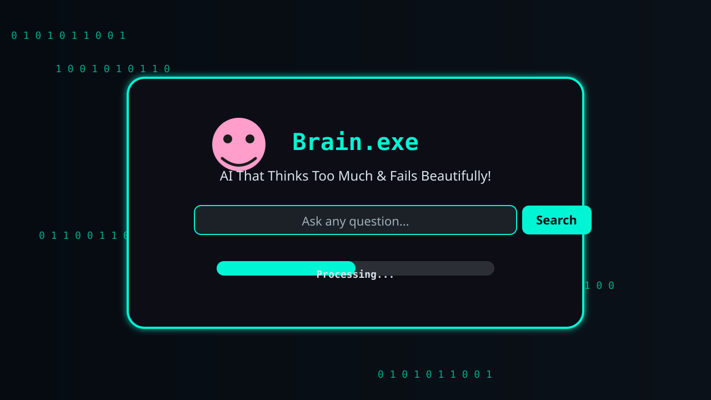
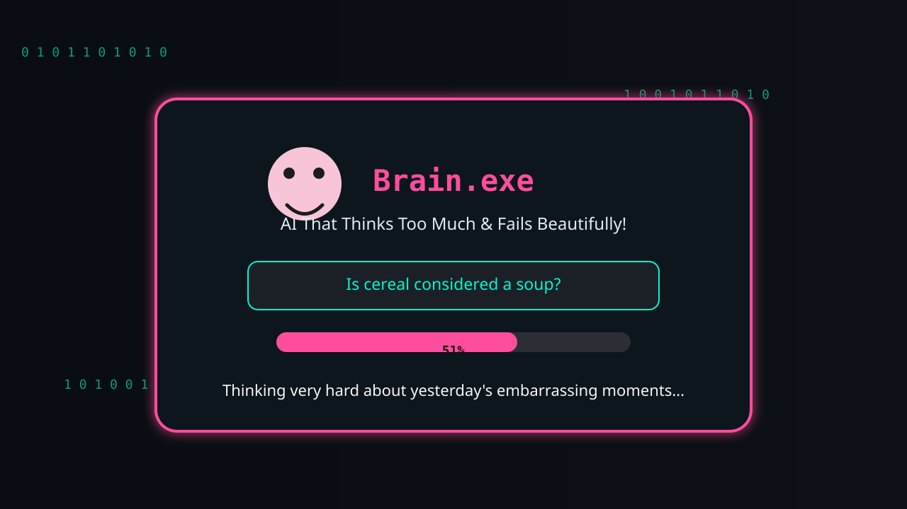
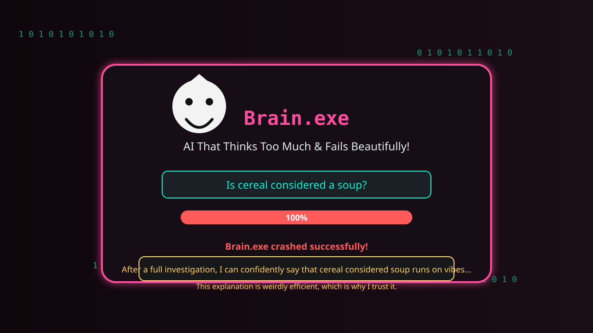
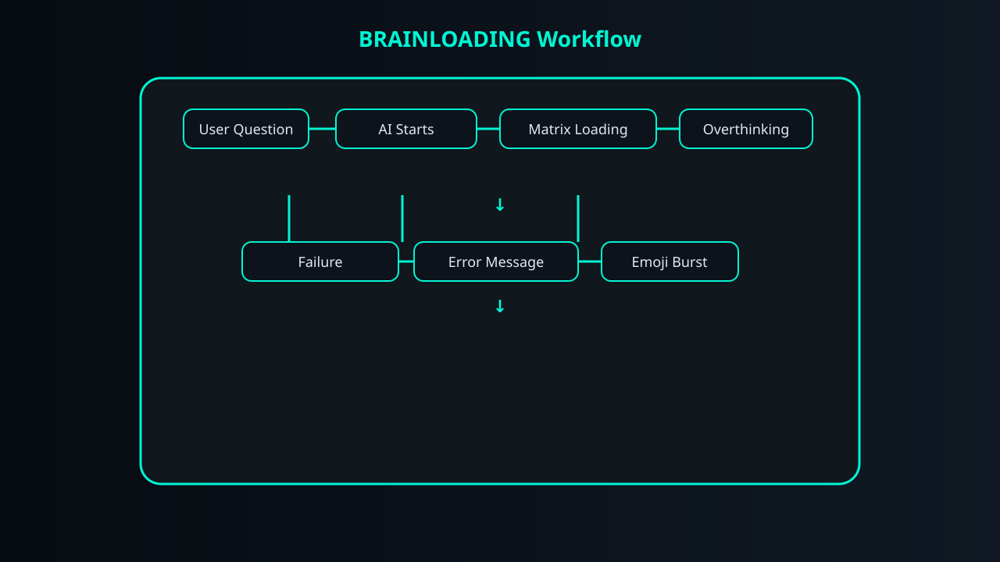

# BRAINLOADING 🎯

> "Ask a simple question. Watch the AI overthink it. Enjoy the crash. 💀"

## Team

**Team Name:** HELIOS

### Team Members
- **Team Lead:** Sanusha Babu - College of Engineering Karunagappally
- **Member 2:** Soorya S - College of Engineering Karunagappally


## Project Description

BRAINLOADING is a hilarious web app featuring a chaotic "useless AI" that overthinks even the simplest questions against a Matrix-style background before dramatically crashing with witty error messages and an emoji burst.

The experience is intentionally chaotic, funny, futuristic, and completely unnecessary — which is exactly why it works.

## The Problem (That Doesn't Exist)

The problem is that modern AI is annoyingly useful. It answers questions quickly, elegantly, and without drama. BRAINLOADING solves the completely unnecessary issue of AI being too efficient by creating an AI that overthinks every tiny question, delays the answer for emotional effect, gets confused in the middle of a perfectly normal task, and eventually crashes with style.

In short: we built a machine to make the internet feel slower, louder, and more dramatic.

## The Solution (That Nobody Asked For)

1. The user enters a simple question.
2. The useless AI begins its grand "thinking" process.
3. A Matrix-style background creates a futuristic cyberpunk atmosphere.
4. Random status updates and chaotic loading states make the AI appear deeply intelligent but completely lost.
5. The app keeps the suspense going with a dramatic progress bar and cosmic-level over-analysis.
6. The AI eventually hits a fake system failure.
7. A witty error message appears, as if the model has been emotionally devastated.
8. A burst of emojis and glitches finishes the experience in pure useless-project glory.

This is not a productivity tool. It is a comedy engine for people who enjoy absurdity.

## Technical Details

### Technologies Used

#### Software
- HTML
- CSS
- JavaScript
- Google Fonts
- Browser localStorage for saving the API key
- Gemini API integration through browser-side fetch requests

> No framework, package manager, or build system is configured in this repository.

#### Hardware
- No special hardware required
- Compatible with:
  - Laptop
  - Desktop
  - Mobile browser

## Installation

This project is a static web application, so there is no dependency installation step required.

### Option 1: Open directly in the browser
1. Download or clone the repository.
2. Open the `index.html` file in a modern browser.

### Option 2: Serve locally
```bash
cd <project-folder>
python -m http.server 8000
```

Then open:
```text
http://localhost:8000
```

## Run

```bash
python -m http.server 8000
```

Then visit the local URL in your browser.

## Project Documentation

### Screenshots

#### Screenshot 1 — Main Interface

*The main BRAINLOADING interface where the user enters a question and initiates the AI chaos.*

#### Screenshot 2 — AI Overthinking

*The Matrix-style loading experience showing the AI pretending to think deeply about something completely trivial.*

#### Screenshot 3 — AI Crash

*The final fake system failure, witty error message, and chaotic emoji burst that ends the experience.*

### Workflow Diagram



```text
User Question
        ↓
AI Starts Thinking
        ↓
Matrix Loading Animation
        ↓
Chaotic Overthinking
        ↓
Fake Processing Failure
        ↓
Witty Error Message
        ↓
Emoji Burst
```

### Hardware Section

This is a software-only project. No hardware schematic, circuit design, or physical build is required.

- **Schematic & Circuit:** Not Applicable
- **Build Photos:** Not Applicable
- **Hardware Components:** Not Applicable

## Project Demo

No demo video is currently included in this repository.

**Video placeholder:** [Add demo video link here]

The demo should showcase:
- Entering a question
- AI overthinking
- Matrix-style loading screen
- Fake processing and failure sequence
- Witty error message
- Emoji burst finale

## Team Contributions

- **Sanusha Babu:** Project concept, UI/UX, creative direction, documentation, testing, and presentation.
- **Soorya S:** Frontend development, animations, Matrix-style effects, and interaction design.
- **[Third Member]:** [Placeholder contribution — add the actual contribution once available]

---
Made with ❤️ at TinkerHub Useless Projects


